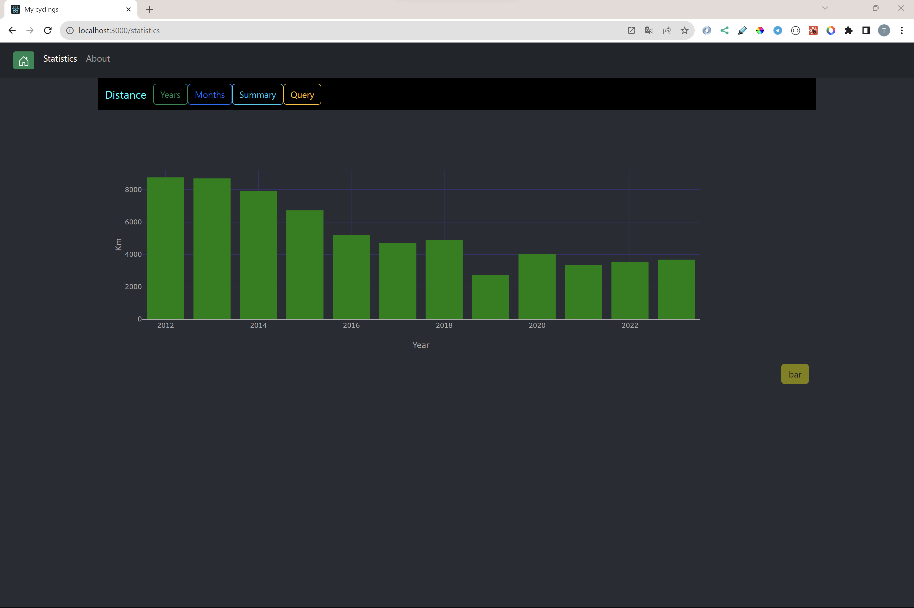

## Modern Software Dev: Mini project 1

3 November 2023

Timo Laakkonen AA4598

### Cycling statistics

**Publication:**

It was planned to publish to Azure, but no luck despite numerous attempts.
Possibly the large size of the csv file caused problems. It would be reasonable to store the data in e.g. Mongodb Atlas noSQL database.

**Video:**

https://jamkstudent-my.sharepoint.com/:v:/r/personal/aa4598_student_jamk_fi/Documents/Tallenne-20231105_151454.webm?csf=1&web=1&e=0WoTMy&nav=eyJyZWZlcnJhbEluZm8iOnsicmVmZXJyYWxBcHAiOiJTdHJlYW1XZWJBcHAiLCJyZWZlcnJhbFZpZXciOiJTaGFyZURpYWxvZyIsInJlZmVycmFsQXBwUGxhdGZvcm0iOiJXZWIiLCJyZWZlcnJhbE1vZGUiOiJ2aWV3In19

https://jamkstudent-my.sharepoint.com/:v:/r/personal/aa4598_student_jamk_fi/Documents/Tallenne-20231105_163735.webm?csf=1&web=1&e=vaA6ol&nav=eyJyZWZlcnJhbEluZm8iOnsicmVmZXJyYWxBcHAiOiJTdHJlYW1XZWJBcHAiLCJyZWZlcnJhbFZpZXciOiJTaGFyZURpYWxvZyIsInJlZmVycmFsQXBwUGxhdGZvcm0iOiJXZWIiLCJyZWZlcnJhbE1vZGUiOiJ2aWV3In19

**Source code:**

https://gitlab.labranet.jamk.fi/AA4598/mycycling

### 1. General introduction

#### The idea of the application

As an athletics I am interested in statistics of the activities e.g. summarize time, distance, speed at some period.

There is quite a lot of data, so it needs to be mined/filtered as needed.
In this exercise, the visual data analysis is limited to the distance variable.

There are three routes at this application; Home, Statistics and About.

### Home
The application initially opens to the home view.

### Statistics

#### Options/Actions

##### Years
Shows the annual number of kilometers for the entire history

##### Months
The number of kilometers of the selected year is shown at the monthly level

###### Summary

Shows the number of kilometers per month in different years throughout history

##### Query

Activity information can be searched for the selected time period.

### About

## 2. Description of technologies

### Brief description of using different technologies

Frontend is a SPA application implemented with the React framework.
    
The design of the user interface is implemented with React-Bootstrap
and data visualization with the Plotly graphics library.

The activity data is in csv (comma separated values) format.
Data processing is largely based on the use of danfo.js kirasto,
Danfo.js is Pandas like library for javascript.

##### Used libraries (package.json)

* "bootstrap": "^5.3.2", UI component library
* "react-bootstrap": "^2.9.1", UI component library
* "danfojs": "^1.1.2", a Pandas-like library for data manipulation and analysis
* "plotly.js": "^2.17.1", data visualization graphics/plots
* "react-plotly.js": "^2.6.0", data visualization graphics/plots    
* "react-router-bootstrap": "^0.26.2", related to SPA Router
* "react-router-dom": "^6.17.0", related to SPA Router
* "react-bootstrap-icons": "^1.10.3", UI component library related icons
* "react-datepicker": "^4.21.0", date picker
* "react-markdown": "^9.0.0", enables the display of a markdown document
* "remark-gfm": "^4.0.0", plugin related to react-markdown library

#### Commands to get the development version from Github to work on your computer

The project can be copied to your computer with the command:

`git Clone https://gitlab.labranet.jamk.fi/AA4598/mycycling.git`

node_modules must be installed at the root of the frontend with the command:

`nmp i`

start the client from the front end with the command:

`nmp start`

the application starts at the browser address `http://localhost:3000/`

### To be developed
Features and functions can be added to the application with moderate effort.
For example, the following information can be easily clarified:
* how many performances were there in total?
* what was the average distance traveled for the performance?
* what was the average heart rate
* which was the highest average heart rate of the performances
     * and when was this, how much was e.g. the distance and time at that time?
* what was the average heart rate of the lowest performance?
     * and when was this, how much was e.g. the distance and time at that time?
* what was the average of the average execution speeds?
* what was the longest journey?
* what was the longest performance in terms of time, was it also the longest in distance?
* what was the fastest performance km/h and what was the distance then?
* how many kilometers were accumulated in a certain year, e.g. 2015
     * which were the 10 longest performances in the year